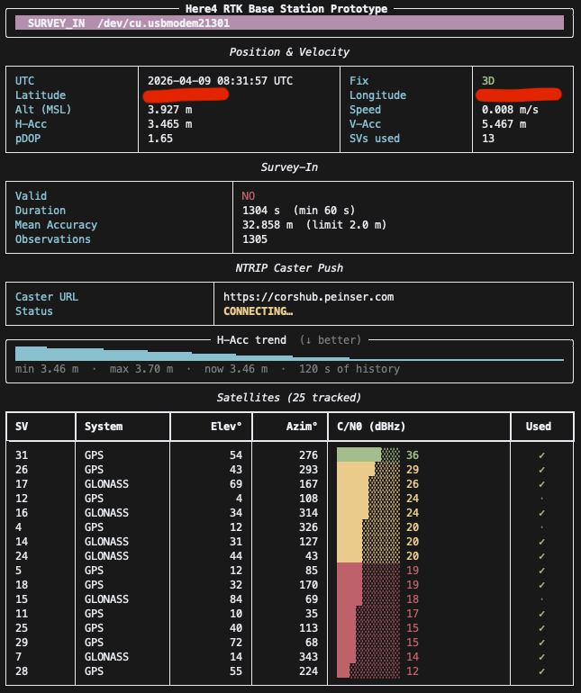

# CORSHub

Continuously Operating Reference Station Hub - Python-based NTRIP (V2) caster for aggregating RTK corrections from a network of CORS base stations and distributing them to NTRIP clients.

---

## Table of Contents

- [Tools](#tools)
- [Prerequisites](#prerequisites)
- [Getting Started](#getting-started)
- [Project Structure](#project-structure)
- [Development Workflow](#development-workflow)
- [Running Tests](#running-tests)
- [Code Quality](#code-quality)
- [Documentation](#documentation)
- [Docker](#docker)
- [CI/CD](#cicd)
- [Contributing](#contributing)

---

## Tools

### Here4 Base Station Caster (`tools/here4-base-caster.py`)

A terminal tool that turns a [Here4](https://docs.cubepilot.org/user-guides/here-4/here-4-base) u-blox receiver into a live NTRIP v2 base station. It handles the full lifecycle automatically — device discovery, initial configuration, survey-in, and streaming RTCM corrections to a CORSHub caster.



#### How it works

| Phase | What happens |
|-------|-------------|
| **Searching** | Scans serial ports for a u-blox device (USB VID `0x1546` or `/dev/ttyACM*`). |
| **Connecting** | Opens the port at 115 200 baud and enables NAV-PVT, NAV-SAT, and NAV-SVIN messages at 1 Hz. |
| **Monitoring** | Streams live position, satellite C/N0, and accuracy data. Waits for a valid 3D GNSS fix. |
| **Survey-In** | Starts survey-in (CFG-TMODE3). Accumulates observations until the mean position accuracy drops below 2 m for at least 60 s. Enables RTCM 3.3 output messages in parallel (1005, 1074, 1084, 1094, 1124, 1230). |
| **Fixed** | Streams every RTCM correction frame from the serial port to the configured CORSHub mountpoint over NTRIP v2 HTTP PUT. |

The live display refreshes at 2 Hz and shows position, velocity, pDOP, UTC time, survey-in progress, RTCM output statistics, NTRIP caster push status,  and a per-satellite C/N0 table.

#### Usage

```bash
# Survey-in mode (automatic position estimation):
python tools/here4-base-caster.py \
    --caster-url https://corshub.peinser.com \
    --mountpoint HERE4 \
    --username HERE4 \
    --password <password>

# Fixed mode (known surveyed position — best absolute accuracy):
python tools/here4-base-caster.py \
    --lat 50.85034 --lon 4.35171 --alt 65.4 \
    --caster-url https://corshub.peinser.com \
    --mountpoint HERE4 \
    --username HERE4 \
    --password <password>
```

> **Survey-in vs. fixed mode** — Survey-in gives ~2 m absolute base accuracy, which translates to ~2 m absolute rover accuracy (RTK relative accuracy is always centimetre-level regardless). For sub-metre absolute accuracy, place the antenna on a surveyed mark and supply `--lat`, `--lon`, `--alt`.

#### Dependencies

All required packages are included in the project's main dependency set (`aiohttp`, `pyubx2`, `pyrtcm`, `pyserial`, `rich`). No separate install step is needed if the project virtualenv is active.

---

## Prerequisites

**For Option A (Dev Container):**
- [Docker](https://docs.docker.com/get-docker/) (Desktop or Engine)
- [VS Code](https://code.visualstudio.com/) with the [Dev Containers extension](https://marketplace.visualstudio.com/items?itemName=ms-vscode-remote.remote-containers)

**For Option B (local):**
- Python 3.12 or newer
- [uv](https://docs.astral.sh/uv/getting-started/installation/)

---

## Getting Started

### Option A — Dev Container (recommended)

1. **Clone the repository:**

   ```bash
   git clone git@github.com:peinser/corshub.git
   cd corshub
   ```

2. **Open in VS Code and reopen in container:**

   ```
   Ctrl+Shift+P  →  Dev Containers: Reopen in Container
   ```

   VS Code will build the container image and run the post-creation script, which installs all dependencies automatically via `uv sync --locked`.

3. **Verify the setup:**

   ```bash
   make help
   ```

### Option B — Local Setup

1. **Clone the repository:**

   ```bash
   git clone git@github.com:peinser/corshub.git
   cd corshub
   ```

2. **Install uv** (if not already installed):

   ```bash
   curl -LsSf https://astral.sh/uv/install.sh | sh
   ```

3. **Install dependencies:**

   ```bash
   make setup
   ```

4. **Verify the setup:**

   ```bash
   make help
   ```

---

## Project Structure

```
corshub/
├── .changelog/          # Pending changelog entries (towncrier)
├── .devcontainer/       # VS Code dev container definition
├── .github/
│   ├── dependabot.yml   # Automated dependency updates (weekly)
│   └── workflows/
│       ├── docs.yml     # Build and deploy documentation to GitHub Pages
│       └── image.yml    # Build and push Docker image to registry
├── docker/
│   ├── Dockerfile       # Multi-stage build: builder → validate → production
│   └── entrypoint.sh    # Container entrypoint
├── docs/                # MkDocs source
├── tools/               # Tools (e.g., here4 base NTRIP caster)
├── src/
│   └── corshub/         # Package source code
│       ├── __init__.py
│       └── __version__.py
├── tests/               # pytest test suite
├── CHANGELOG.md         # Auto-generated changelog
├── CONTRIBUTING.md      # Contribution guidelines
├── Makefile             # Common development tasks
├── mkdocs.yml           # Documentation configuration
├── pyproject.toml       # Project metadata, dependencies, and tool config
└── uv.lock              # Locked dependency versions (do not edit manually)
```

---

## Development Workflow

All common tasks are available through `make`. Run `make help` to see the full list.

| Command | Description |
|---|---|
| `make setup` | Install all dependencies (first-time setup) |
| `make sync` | Re-sync dependencies after editing `pyproject.toml` |
| `make lock` | Update `uv.lock` after adding or removing dependencies |
| `make format` | Auto-format code with Ruff |
| `make lint` | Run Ruff (linter) and MyPy (type checker) |
| `make test` | Run the test suite with coverage |
| `make clean` | Remove build artefacts and caches |
| `make all` | Full local CI pipeline: clean → install → lint → test |

### Adding a dependency

```bash
uv add <package>          # runtime dependency
uv add --dev <package>    # development-only dependency
make lock                 # update uv.lock
```

---

## Running Tests

```bash
make test
```

This runs `pytest` with branch coverage enabled. A minimum of **75%** coverage is required. To view a detailed HTML report:

```bash
uv run pytest --cov=src --cov-report=html
open htmlcov/index.html
```

Tests requiring async support use `pytest-asyncio`. Mark async test functions with `@pytest.mark.asyncio`.

---

## Code Quality

### Format

```bash
make format
```

### Lint

```bash
make lint
```

Runs two checks in sequence:

1. **Ruff** — covers flake8, isort, pyupgrade, bugbear, and more.
2. **MyPy** — strict type checking across `src/corshub/` and `tests/`.

### Security scan

```bash
uv run bandit -r src/
```

---

## Documentation

### Serve locally

```bash
uv run --group docs mkdocs serve
```

Open [http://localhost:8000](http://localhost:8000) in your browser.

### Build

```bash
uv run --group docs mkdocs build
```

### Deploy

Documentation is deployed to GitHub Pages automatically by the `docs.yml` workflow on every push to `main`.

---

## Docker

| Stage | Purpose |
|---|---|
| `builder-base` | Installs locked dependencies (no dev extras) |
| `validate` | Runs format check, Ruff, MyPy, pytest, and Bandit |
| `production` | Minimal runtime image; runs as a non-root user (UID 1001) |

```bash
# Run only the validation stage
docker build --target validate -f docker/Dockerfile .

# Build the final production image
docker build -f docker/Dockerfile -t corshub:local .

# Run
docker run --rm corshub:local
```

---

## CI/CD

| Workflow | Trigger | What it does |
|---|---|---|
| `docs.yml` | Push to `main` (docs/src/mkdocs) or manual | Builds and publishes documentation to GitHub Pages |
| `image.yml` | Push to `main`/`development` (docker/src/tests) or manual | Validates and builds the Docker image, pushes to registry |

---

## Contributing

See [CONTRIBUTING.md](CONTRIBUTING.md) for the full contribution guide.
